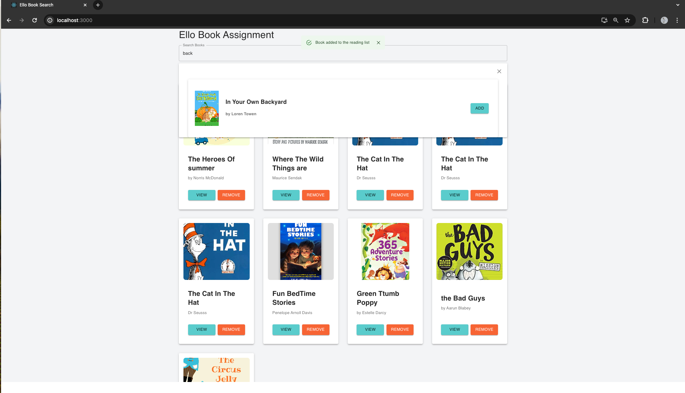
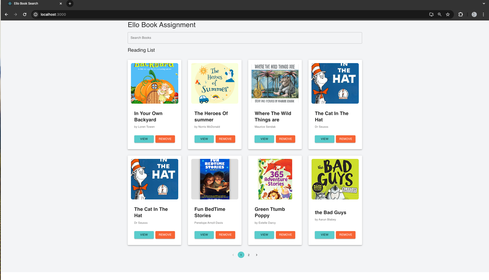
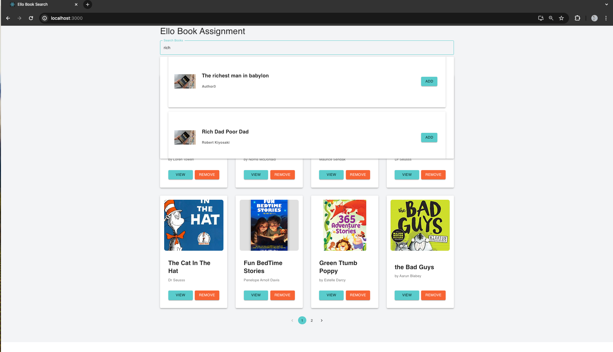
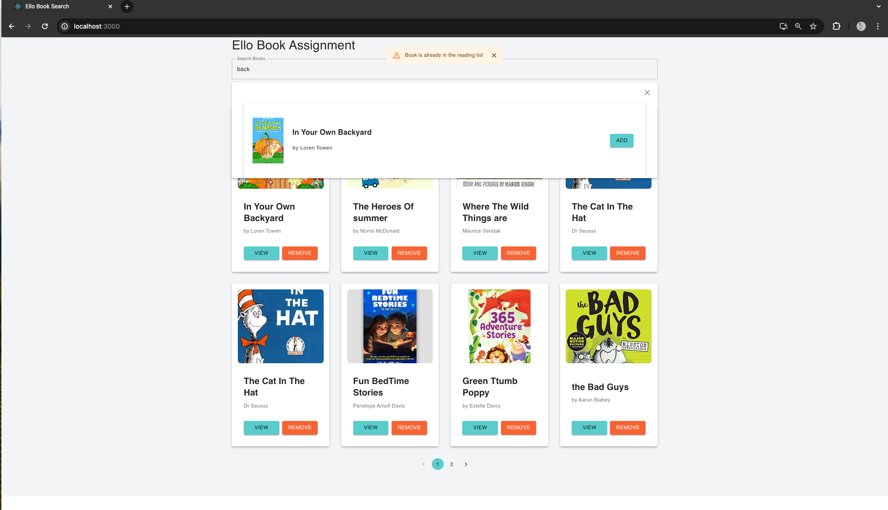

````markdown
# Ello Fullstack Engineering Challenge

## Overview

This project is a fullstack web application developed as part of the Ello Fullstack Engineering Challenge. The application allows teachers to search for books and manage a reading list. It consists of a React frontend and a Node.js backend with a PostgreSQL database.

## Features

1. **Search Books:**

   - Search for books by title.
   - Display search results with book title, author, and a button to add the book to the reading list.
     

2. **Reading List:**

   - Display a list of books added by the teacher.
   - Provide "View" and "Remove" buttons for each book.
   - Pagination for easy navigation through a large list of books.

3. **Book Details:**
   - Display book details including chapters.
   - Navigation buttons to move between chapters.
   - "Back to Home" button to return to the main page.

   # Navigating the App.
1.Landing page

## Home


### Hot and cold weather showing a dynamic background as on the screenshots below.
- Temp below 20 is cold and vice versa

_Below are some screenshots of screens from the running application:_
| Cold temperatures below 20      |  Hot Weather above 20 | Mobile Screen Responsive| Error handling Screen |
| ----------- | ----------- | ----------- | ----------- |
|  | |  |  |


## Setup and Installation

### Prerequisites

- Node.js
- PostgreSQL

### Backend Setup

1. Clone the repository and navigate to the backend directory.

   ```sh
   git clone <repository-url>
   cd backend
   ```
````

2. Install dependencies.

   ```sh
   npm install
   ```

3. Create a `.env` file with the following environment variables, check the provided env-example on my root backend dir:

   ```env
   DB_USER=<your-database-username>
   DB_PASSWORD=<your-database-password>
   DB_NAME=<your-database-name>
   DB_HOST=localhost
   DB_PORT=5432
   ```

4. Start the backend server.

   ```sh
   npm start
   ```

### Frontend Setup

1. Navigate to the frontend directory.

   ```sh
   cd frontend
   ```

2. Install dependencies.

   ```sh
   npm install
   ```

3. Start the frontend application.

   ```sh
   npm start
   ```


## Best Practices

1. **Code Quality:**

   - Use ESLint for linting.
   - Follow consistent code style with Prettier.

2. **Error Handling:**

   - Handle errors gracefully in both frontend and backend.
   - Display user-friendly error messages.

3. **State Management:**

   - Use Context API for state management in the frontend.

4. **Responsive Design:**

   - Ensure the application is responsive and works well on different screen sizes.

## Folder Structure

### Backend

```sh
backend/
├── src/
│   ├── controllers/
│   ├── models/
│   ├── routes/
│   ├── index.js
│   └── database.js
├── .env
├── package.json
└── README.md
```

### Frontend

```sh
frontend/
├── src/
│   ├── components/
│   ├── context/
│   ├── hooks/
│   ├── pages/
│   ├── __tests__/
│   ├── App.js
│   ├── index.js
│   └── setupTests.js
├── public/
├── .env
├── package.json
└── README.md
```

## Conclusion

This project demonstrates the implementation of a fullstack web application with React and Node.js. It covers essential features like searching, managing a reading list, and viewing book details. The setup includes best practices for code quality, error handling, state management, and testing.

```

### Notes

1. **Setup and Installation**:
   - The instructions for setting up both the backend and frontend are provided, including the necessary environment variables for the backend.

2. **Testing**:
   - Detailed instructions on how to run the tests and check the test coverage are provided.

3. **Best Practices**:
   - Guidelines for maintaining code quality, handling errors, managing state, ensuring responsive design, and writing tests are included.

4. **Folder Structure**:
   - The folder structure for both the backend and frontend is outlined to help understand the project organization.

With this detailed README, anyone should be able to understand the project setup, functionality, and best practices followed.
```
